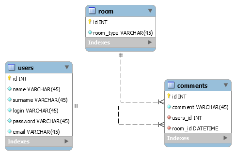

# aplikacje-www
141313/133214

# Model bazy danych


# Jak uruchomić
Sklonować repozytorium lokalnie:
```bash
git clone "repo.git"
```
W project/app_www/ należy zainstalować środowisko:
```bash
pipenv install
pipenv shell
```
Następnie utworzyć migrację:
```bash
./manage.py makemigrations
./manage.py migrate
```
Tworzymy admina:
```bash
./manage.py createsuperuser
```
I uruchamiamy serwer:
```bash
./manage.py runserver
```

# Jak przetestować aplikacje
ścieżki:

     - dostep do bazy danych Django
    path("admin/", admin.site.urls),
    
    path("api/", include("rest_framework.urls")),
    
    - Strona startowa
    path("", Index.as_view(), name="index"),
    
    - Zwraca liste zarejestrowanych użytkownikow
    path("users/", Users.as_view(), name="users"),  
    
    - Zwraca liste utworzonych pokojów
    path("rooms/", Rooms.as_view(), name="rooms"),  
    
    - Zwraca liste dodanych komentarzy
    path("comments/", Comments.as_view(), name="comments"),
    
    - Dodaj uzytkownika:
    wymagane pola - login, email, password
    path("users/add/", CreateUser.as_view(), name="new_user"),
    
    - Dodaj pokój
    wymagane pole - name
    path("rooms/add/", CreateRoom.as_view(), name="new_room"),
    
    - dodaj komentarz
    wymagane pola - conetent, user(login), room(name)
    path("comments/add/", AddComment.as_view(), name="new_comment"),
    
    - Edytuj profil, pola - name,  surname, email, login, password
    path("users/edit/", EditProfile.as_view(), name="edit_profile"),
    
    - Edytuj pokój, pola - name
    path("rooms/edit/", EditRoom.as_view(), name="edit_room"),
    
    - Edytuj użytkownika address użytkownika (zalogowany użytkownik edytuje tutaj swój adres)
    path("users/edit/address/", CreateUserAddress.as_view(), name="address"),
    


